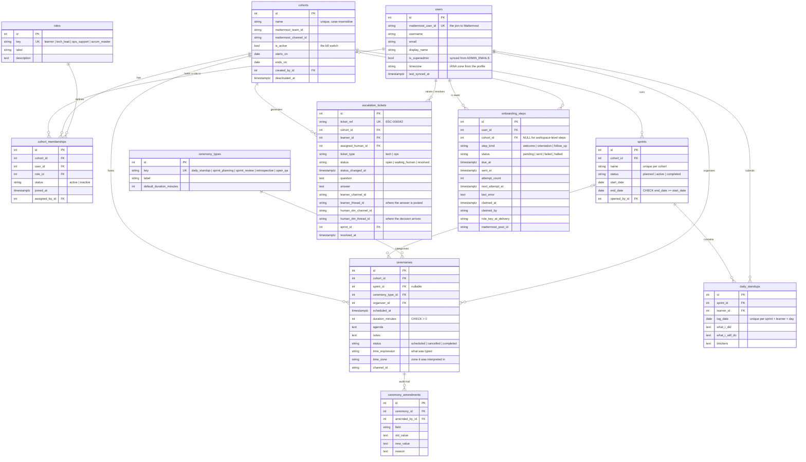

# Database & Migrations

PostgreSQL is SprintFlow's ground truth: who belongs to which cohort, what role
they hold there, which ceremonies and sprints exist, which escalations are open,
and which onboarding messages are still owed. Qdrant holds embeddings and
nothing else; no authorisation decision is ever made from a vector search.

The same database also hosts tables that are **not ours**: the LangGraph
checkpointer's `checkpoints`, `checkpoint_blobs`, `checkpoint_writes` and
`checkpoint_migrations`. Alembic is configured to never see them (see
*Externally owned tables* below).

---

## Schema

Eleven tables, created by Alembic revision `0001_sprintflow_domain` (with `0002_sprints_name_ci`
adding one functional unique index on top),
all with explicit plural `snake_case` names, integer primary keys, named
constraints and timezone-aware `created_at` / `updated_at` audit columns.



### Keys worth knowing

| Constraint | Meaning |
| --- | --- |
| `ix_users_mattermost_user_id` (unique) | one `users` row per Mattermost account; `mattermost_user_id` is the join on every inbound event |
| `ux_cohorts_name_lower` (unique on `lower(name)`) | "Backend-01" and "backend-01" are the same cohort |
| `uq_cohort_memberships_user_cohort` (`user_id, cohort_id`) | **one role per person per cohort** — a different role in another cohort is a second row; a second role in the same cohort is an update |
| `uq_sprints_cohort_name` | sprint names are unique inside a cohort, not globally |
| `uq_daily_standups_sprint_learner_day` | one standup entry per person per day per sprint |
| `ix_escalation_tickets_ticket_ref` (unique) | the human-facing `ESC-000042` reference |
| `uq_onboarding_steps_user_cohort_kind` (`NULLS NOT DISTINCT`) | one welcome / follow-up per person (cohort `NULL`), one orientation per person per cohort; a replayed event cannot enqueue a second one |
| every FK `fk_<table>_<column>_<target>`, every PK `pk_<table>` | explicitly named so a downgrade can drop them by name |

### Lifecycle values

Stored as plain strings, defined once in `app/models/enums.py` as `StrEnum`s
with display labels and the aliases people type (`"retro"` → `retrospective`,
`"scrum master"` → `scrum_master`). No PostgreSQL enum types: a new value is a
new row or a new constant, never a migration.

### The kill switch

`cohorts.is_active = false` (set through `cohorts.set_cohort_active`) is the
one flag every scheduled job filters on. `onboarding.halt_steps_for_cohort`
marks that cohort's pending deliveries `halted`; reminders and standups (later
sprints) filter on the same column. `deactivated_at` records when it was thrown.

### Instants and dates

Every instant column is `timestamptz`; the models declare
`DateTime(timezone=True)` through `TZ_DATETIME`, and the data-access layer
refuses naive datetimes (`app.models.require_aware`) before they reach the
driver, because PostgreSQL would otherwise interpret them in the session's
zone. Sprints use calendar `date`s on purpose: "Monday to the Friday after
next" is the same for everyone regardless of zone; the ceremonies inside carry
exact instants.

---

## Externally owned tables

`app/services/database.py` lists `EXTERNALLY_OWNED_TABLES` — the four
checkpointer tables plus anything mem0 may create. `alembic/env.py` passes
`include_object` to Alembic so those tables are invisible to autogenerate and
to `alembic check`; the migration never references them, and `downgrade()`
drops an explicit list of domain tables only. `scripts/verify_schema.py`
proves it by pre-creating a fake `checkpoints` table with one row before
upgrading, downgrading and upgrading a throwaway database.

---

## Migrations with Alembic

Alembic owns the schema. The app never calls `create_all()`.

### How the schema reaches a database

- **At container start.** `ai-core/scripts/docker-entrypoint.sh` runs
  `alembic upgrade head` before uvicorn unless `AI_CORE_MIGRATE_ON_START=false`.
  `make up` therefore brings a blank database to head; `/health` returns 503
  while the `cohorts` table is missing so the container cannot look healthy
  without the schema.
- **Explicitly.** From the repository root, with the stack up:

```bash
make migrate               # alembic upgrade head in the ai-core container
make migrate-downgrade     # alembic downgrade -1 (0002 -> 0001 drops the sprint-name index; again -> empty)
make migrate-history       # history + current revision
make seed                  # re-seed roles and ceremony types (idempotent)
python3 scripts/verify_schema.py   # the full proof on a throwaway database
```

Full reversal is `docker compose exec -T ai-core /app/.venv/bin/alembic
downgrade base`; it removes the eleven domain tables and nothing else.

### One consolidated revision (plus one forward revision)

Sprint 1 ships one consolidated revision, `0001_sprintflow_domain`, instead of the six
branch revisions that preceded it. Those could not be downgraded (an unnamed
FK on `escalation`) and could not upgrade a populated database (a `NOT NULL`
column added without a backfill). Nothing outside development machines had
applied them, so consolidating was cheaper and safer than a forward chain of
renames.

A development database that *did* apply the old chain has an `alembic_version`
row Alembic can no longer locate. Reset it once:

```bash
make db-reset      # asks for confirmation; drops the domain + legacy tables and alembic_version,
                   # keeps the checkpointer tables, then re-runs `make migrate`
```

### Adding a revision later

1. Change the model under `app/models/` (and export it from
   `app/models/__init__.py` if it is new — `DOMAIN_TABLES` and the unit tests
   pin the import surface).
2. Generate: `docker compose exec -T ai-core /app/.venv/bin/alembic revision --autogenerate -m "add x"`.
3. **Read the generated file.** Name every constraint (`fk_*`, `uq_*`,
   `ck_*`), keep `DateTime(timezone=True)`, backfill before tightening
   nullability, and confirm it touches no externally owned table.
4. `make migrate`, then `python3 scripts/verify_schema.py`.

---

## Data-access layer — `app/services/domain/`

Downstream code never writes SQL. One async module per aggregate:

| Module | Answers |
| --- | --- |
| `identity` | who is this chat identity? (`get_user_by_mattermost_id`, `get_user_by_username`, `get_user_by_email`, `upsert_mattermost_user`) |
| `cohorts` | which cohort, which role here, who is in it (`resolve_cohort`, `get_role_for_user_in_cohort`, `upsert_membership`, `list_cohort_members`, `set_cohort_active`) |
| `sprints` | the cohort's time boxes (`create_sprint`, `get_sprint_by_name`, `find_overlapping_sprints`, `get_active_sprint`) |
| `ceremonies` | the calendar and its audit trail (`create_ceremony`, `list_ceremonies`, `find_overlapping_ceremonies`, `update_ceremony`, `list_amendments`) |
| `standups` | daily progress (`upsert_daily_standup`, `list_daily_standups`) |
| `escalations` | tickets and both conversations (`create_escalation_ticket`, `get_escalation_ticket_by_human_thread`, `set_escalation_status`) |
| `onboarding` | the delivery outbox (`enqueue_step`, `claim_due_steps`, `mark_step_sent`, `mark_step_failed`, `halt_steps_for_cohort`) |
| `reference_data` | `seed_reference_data()` — idempotent, also run at startup |

Every function is `async`, typed, and takes an optional `session` so several
calls can share one transaction. Without a session it opens one, commits on
success and rolls back on any exception (`app.services.database.session_scope`).
Rows come back fully loaded (`expire_on_commit=False`) and carry no
relationships, so a tool can read `cohort.name` after the session is closed and
nothing lazy-loads outside a transaction.

### Examples

Resolve the requester and answer "what is my role here?":

```python
from app.services.domain import cohorts as cohort_repo
from app.services.domain import identity as identity_repo

user = await identity_repo.get_user_by_mattermost_id(event_user_id)
if user is None or user.id is None:
    ...  # not synced yet — the conversation layer normally does this first
cohort = await cohort_repo.resolve_cohort("Backend-01")   # name or "#7"
role = await cohort_repo.get_role_for_user_in_cohort(user.id, cohort.id)  # Role | None
```

Assign a role idempotently (one row per person per cohort):

```python
lead = await cohort_repo.get_role_by_key(RoleKey.TECH_LEAD)
change = await cohort_repo.upsert_membership(
    user_id=user.id, cohort_id=cohort.id, role_id=lead.id, assigned_by_id=requester.user_id
)
if change.created:                    # ROLE_ASSIGNED
elif change.previous_role_id == lead.id:   # ROLE_ALREADY_ASSIGNED
else:                                 # ROLE_CHANGED (previous role: change.previous_role_id)
```

Schedule a ceremony after checking conflicts, in one transaction:

```python
from app.services.database import session_scope
from app.services.domain import ceremonies as ceremony_repo

async with session_scope() as s:
    clashes = await ceremony_repo.find_overlapping_ceremonies(cohort.id, start, 30, session=s)
    if clashes:
        raise ValidationFailed(...)
    ceremony = await ceremony_repo.create_ceremony(
        cohort_id=cohort.id, ceremony_type_id=standup.id, organizer_id=user.id,
        scheduled_at=start, duration_minutes=30, agenda="...", session=s,
    )
# committed here; `ceremony` is fully loaded
```

`start` must be timezone-aware; a naive datetime raises `ValueError` before any
SQL runs. Touching intervals (10:00–10:30 and 10:30–11:00) do not conflict.

Amend with an audit trail (one `ceremony_amendments` row per changed field):

```python
await ceremony_repo.update_ceremony(
    ceremony.id, amended_by_id=user.id,
    changes={"scheduled_at": new_start, "agenda": "moved"}, reason="clash with review",
)
```

Passing a column outside `AMENDABLE_FIELDS` raises `ValueError`.

### Adding a function

Put it in the module of its aggregate, make it `async`, type every argument,
accept `session: AsyncSession | None = None`, wrap the body in
`async with session_scope(session) as s:`, and return rows or plain values —
never a lazy relationship. If the function stores an instant, call
`require_aware` first.

---

## Working on the schema locally (no Docker Compose)

A throwaway Postgres lets you run the data-access layer, the probe and the
integration tests against a real database without touching the stack:

```bash
cd ai-core
UV_PYTHON=3.13 uv sync --frozen --all-groups
docker exec sprintflow-devdb createdb -U sprintflow mydb || true      # any Postgres 16 will do
export APP_ENV=test POSTGRES_HOST=127.0.0.1 POSTGRES_PORT=55432 POSTGRES_DB=mydb \
       POSTGRES_USER=sprintflow POSTGRES_PASSWORD=devpass OPENAI_API_KEY=x \
       OPENAI_BASE_URL=http://localhost:9 QDRANT_URL=http://localhost:9 \
       MATTERMOST_URL=http://localhost:9 ADMIN_EMAILS=admin@sprints.ai LOG_DIR=/tmp/mydb-logs
mkdir -p "$LOG_DIR"
.venv/bin/alembic upgrade head
.venv/bin/alembic check                                   # "No new upgrade operations detected."
SCHEMA_PROBE_EXPECT_CHECKPOINT_TABLES= .venv/bin/python scripts/verify_schema.py   # the probe, ~130 checks
.venv/bin/python -m pytest -q tests/                      # pure-logic tests
SPRINTFLOW_INTEGRATION_DB=1 .venv/bin/python -m pytest -q tests/integration   # DB-backed tests
.venv/bin/alembic downgrade base
```

`SCHEMA_PROBE_EXPECT_CHECKPOINT_TABLES` tells the probe which checkpointer
tables to expect; leave it empty on a database the checkpointer never touched.
